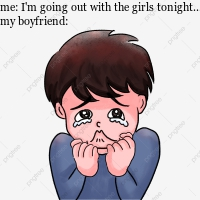

# *1.Introduction*

**Malo e lelei.:smile: I am a currently studying at the [University of Auckland](https://www.auckland.ac.nz/). I am Tongan 🥥 and I can also speak the language fluently. In this file, you will find the meme I made for my first assignment.**

## *2.Meme*

**This is the meme I made.**



**Facts about the meme:**

* The meme is new/original.

* My relationship with my boyfriend motivated me to make this meme. I just find it funny because this is so true about him.
* Also, I know for a fact that alot of relationship can relate to this meme.

### *3.Code*

**Below you'll find the code that I used to make the meme.**

```r
library(magick)

crybaby <- image_read("https://png.pngtree.com/png-clipart/20190618/original/pngtree-boy-cry-hand-painted-illustration-png-image_3919544.jpg") %>%
  image_scale(200)%>%
  image_annotate(text="me: I'm going out with the girls tonight....\nmy boyfriend:",
                 color= "#000000",
                 size= 11,
                 font= "Georgia")
                 
crybaby

crybby.meme<-(crybaby)
image_write(crybby.meme, "meme.png")

```
**This is all I've done for the part 1 of my first assignment. 😅**
